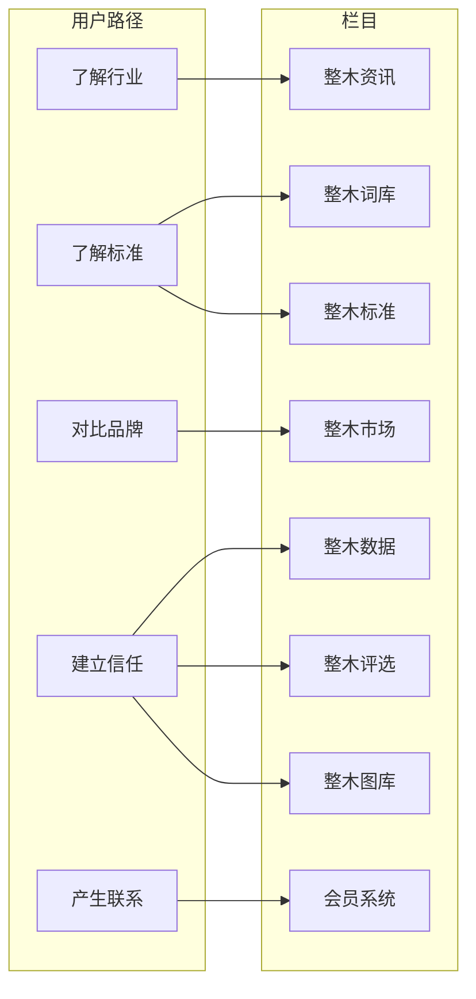

# 栏目体系升级版与用户路径

本文档记录「分栏目结构重构」后的八大栏目与用户路径对应关系，以及栏目级基础设施（定义说明、FAQ、版本号、相关词条）。与 [SEO_AND_AI_RULES.md](./SEO_AND_AI_RULES.md) 对齐，便于 SEO 与 AI 抓取引用。

---

## 一、用户路径与栏目对应关系

栏目顺序与路径一致：**整木资讯 → 整木词库 → 整木标准 → 整木市场 → 整木数据 → 整木评选 → 整木图库 → 会员系统**。

---

## 二、八大栏目及子栏目（path 与分组）

| 栏目       | path         | 子栏目（含分组） |
|------------|--------------|------------------|
| 整木资讯   | `/news`      | 行业趋势、企业动态、技术更新、行业活动（展会报道、论坛纪要、协会活动） |
| 整木市场   | `/market`    | 品牌选择、品类选择、区域品牌、整木行情 |
| 整木词库   | `/dictionary`| 基础概念、技术术语、商业模式、行业角色 |
| 整木标准   | `/standards` | 材料标准（木皮等级、板材等级）、工艺标准（涂装、拼接、安装）、服务标准（验收、售后）、标准共建 |
| 整木数据   | `/data`      | 行业规模、区域分布、行业调研、年度报告 |
| 整木评选   | `/awards`    | 行业评选（十大品牌、工艺奖项、华点榜）、区域榜单、评选规则（评分维度、审核流程、公示制度） |
| 整木图库   | `/gallery`   | 风格分类、工艺分类、空间分类、企业专属图库 |
| 会员系统   | `/membership`| 登录、企业资料管理、资讯发布、图片管理、内容审核状态 |

子栏目较多时通过 **groupLabel**（如「行业活动」「材料标准」）在栏目首页做分组展示，无需三级表。数据与路由以 `lib/site-structure.ts` 与 DB 的 Category / SubCategory 为准。

---

## 三、栏目级基础设施

每个栏目首页具备以下能力（主账号可在「主账号后台」编辑）：

- **定义说明**（definitionText）：首屏第一段，便于 SEO / AI 理解栏目含义。
- **版本标签 / 版本年**（versionLabel、versionYear）：如「2026版」，用于权威性与时效性表达。
- **常见问题（FAQ）**：栏目首页 FAQ 区块，可输出 FAQPage 的 JSON-LD。
- **相关词条**（relatedTermSlugs）：底部链接到词库词条（`/dictionary/[slug]`），强化知识关联。

详见 [PRODUCT_RULES.md](./PRODUCT_RULES.md) 主账号能力与 [SEO_AND_AI_RULES.md](./SEO_AND_AI_RULES.md) 定义先行与结构化数据要求。

---

## 四、品牌页与会员模块

- **品牌页**（`/market/[id]`）：底部提供「联系企业」「查看认证资质」入口，对应 Brand 的 `contactUrl`、`certUrl`。
- **会员系统**：四大后台模块占位路由——企业资料管理（`/membership/profile`）、资讯发布（`/membership/content/news`）、图片管理（`/membership/content/gallery`）、内容审核状态（`/membership/content/status`），后续接权限与接口。

---

## 五、涉及实现

- **结构数据**：`lib/site-structure.ts`（静态兜底）、`prisma/seed.ts` 写入 Category / SubCategory（含 groupLabel）。
- **栏目首页**：`getCategoryWithMetaByHref` + `CategoryHome` 展示定义、分组子栏目、FAQ、版本、相关词条。
- **子栏目列表**：`app/{news|market|dictionary|standards|data|awards|gallery}/[...subSlug]/page.tsx`，href 为 `/{category}/{subSlug.join("/")}`。
- **Sitemap**：`app/sitemap.ts` 从 `getCategories()` 生成所有栏目与子栏目 path，并覆盖词条、标准、品牌、数据等详情页。
